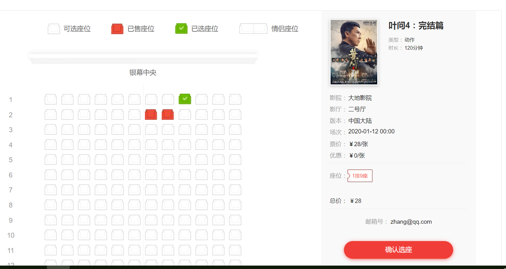
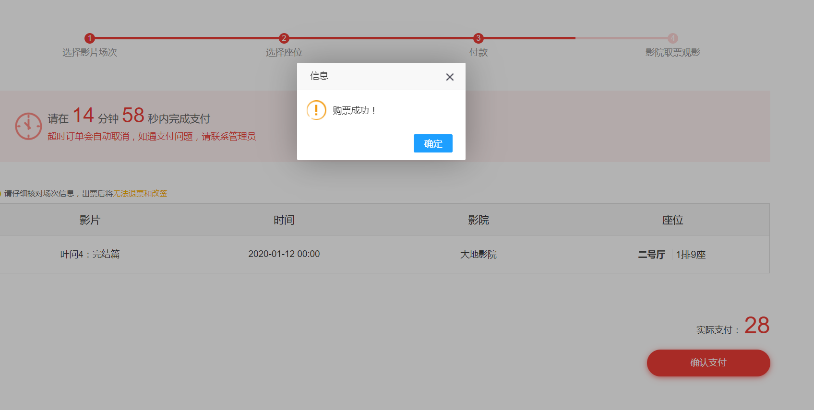
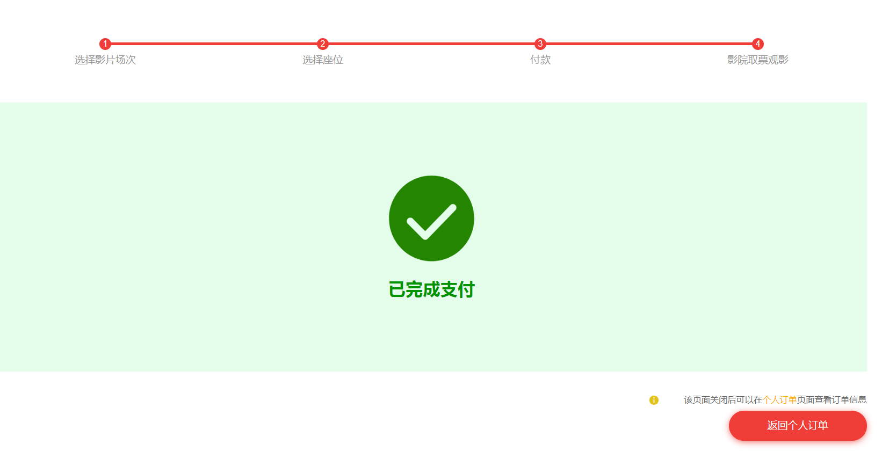
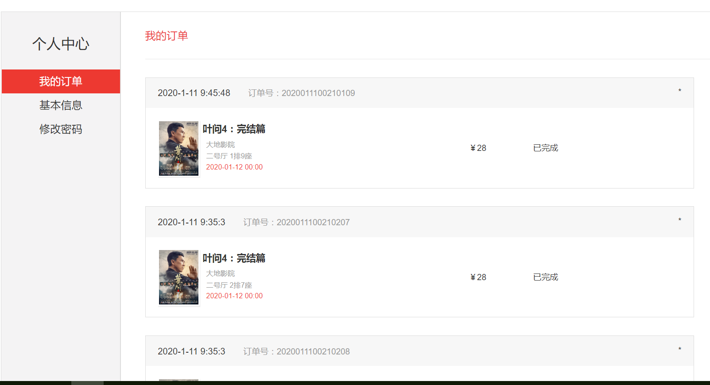
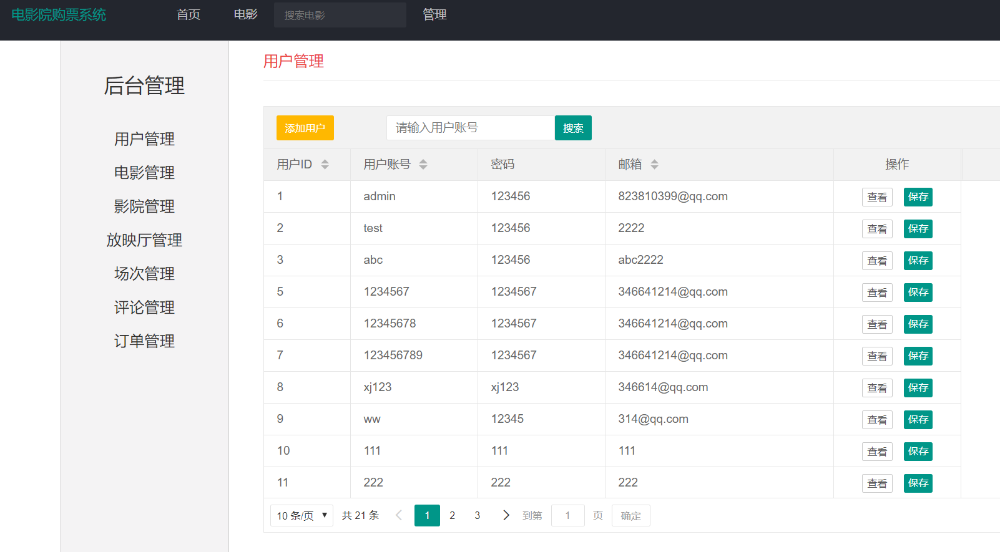

## 基于jsp+servlet的电影院在线购票系统

- <b>完整代码获取地址：从戎源码网 ([https://armycodes.com/](https://armycodes.com/))</b>
- <b>技术探讨、资料分享，请加QQ群：692619798</b> 
- <b>作者微信：19941326836  QQ：952045282</b> 
- <b>承接计算机毕业设计、Java毕业设计、Python毕业设计、深度学习、机器学习</b>
- <b>选题+开题报告+任务书+程序定制+安装调试+论文+答辩ppt 一条龙服务</b>
- <b>所有选题地址 ([https://github.com/YuLin-Coder/AllProjectCatalog](https://github.com/YuLin-Coder/AllProjectCatalog)) </b>

## 项目介绍
基于jsp+servlet的电影院在线购票系统
用户信息管理：用户注册后，可修改个人信息、登录密码等
影片分类：对影片进行分类，按类型、国家区域分类，有筛选功能
影片的信息：（影片的名称、导演、演员、简介及上映时间等）
按价格查询票源；不同影院价格不同
按时间查询票源；
影片的推荐：可根据影片好评度或售票量进行推荐，推荐好评度高或售票量高电影
观影的房间、座位的选择：用户选择观影的影院、房间、座位，用户不能选择已出售的座位
影片的好评度（标准）； 用户登录后可对影片进行评分，总共5星，一颗星两分
用户的评价：用户登录后可对影片写一些评价
影片的下单：用户登录后，进行影片、影院、时间、座位等选择后，可以下单购买电影票
订单信息查询
     用户登录后，可查询自己之前的历史订单信息，包括金额、对应电影票、场次、座位等
系统后台，管理员功能
管理员可对影片分类进行管理，管理影片的类型、区域等
管理员可对影片的信息进行管理，包括影片的名称、导演、演员、简介及上映时间等，对影片进行新增、删除、编辑等。
管理员可对影评信息进行管理，对评语进行审核、删除等。
管理员可对所有电影院中影片价格进行修改
管理员具有对用户信息进行查询、修改等管理功能。
管理员可修改管理员登录密码	
管理员可对电影票订单信息进行查询和管理的操作

## 项目技术
- 编程语言：Java
- 数据库：MySQL
- 前端技术：JSP、JavaScript、bootstrap、JQuery
- 后端技术：Servlet、JDBC

## 运行环境
- JDK版本：JDK1.8及以上
- 开发工具：IDEA、Ecplise、Myecplise都可以
- 数据库: MySQL5.7及以上

## 运行截图

